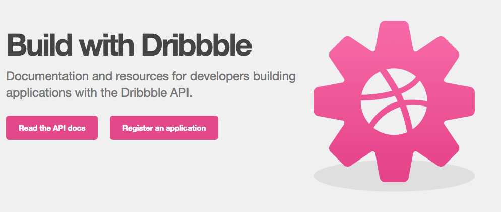
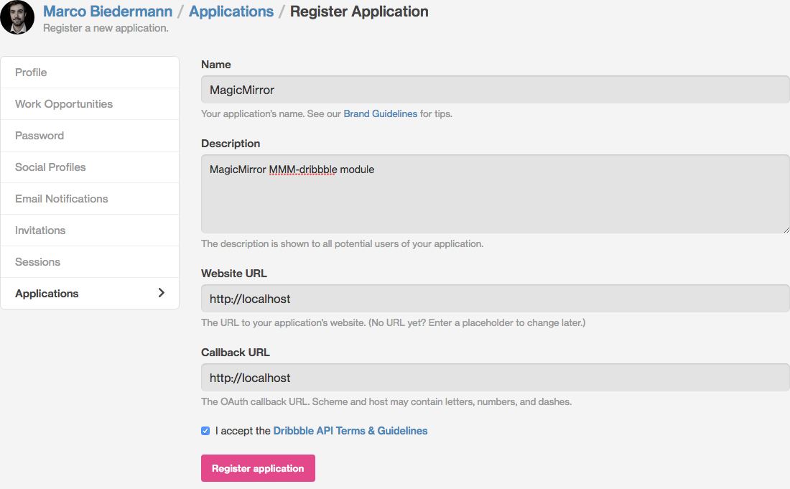
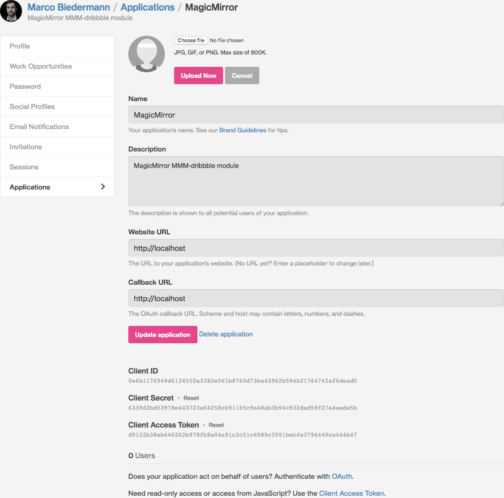

# MagicMirror² Module: MMM-dribbble

## Installation

1. Download `MMM-dribbble` module
1. Place `MMM-dribbble` folder into `MagicMirror/modules` folder
1. Add `MMM-dribbble` module to modules in `MagicMirror/config/config.js`

`MagicMirror/config/config.js`

```js
modules: [
	{
		module: "MMM-dribbble",
		position: "lower_third",
		config: {

		}
	},
],
```

## Configuration

Key | Description | Default | Type
--- | --- | --- | ---
api | dribbble API options | {} | Object
api.base | dribbble API base url | https://api.dribbble.com/v1 | String
api.clientAccessToken | dribbble API client access token | null | String
api.endpoint | dribbble API shots endpoint | shots | String
api.perPage | shots to show | 24 | Integer (min: 0, max: 100)
animationSpeed | Animation speed to show content (in ms) | 1 s | Integer
initialLoadDelay | Delay until shots are initially fetched (in ms) | 2.5 s | Integer
updateInterval | Interval in which shots are updated (in ms) | 10 min | Integer

```js
api: {
	base: "https://api.dribbble.com/v1",
	clientAccessToken: null,
	endpoint: "shots",
	perPage: 24,
},
animationSpeed: 1000,
initialLoadDelay: 1000 * 2.5,
updateInterval: 1000 * 60 * 10,
```

## dribbble API

1. Head over to the [dribbble developer API](http://developer.dribbble.com/) and register an application.



2. Create a new dribbble application. You can put in any information you like to.



3. Copy your **Client Access Token**.


